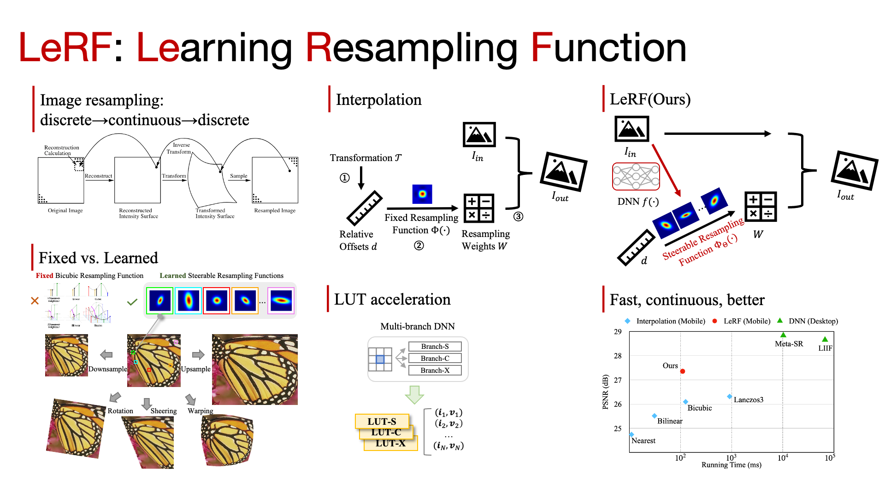

## [CVPR 2023] Learning Steerable Function for Efficient Image Resampling

This is the authors' reimplementation code in PyTorch.


[Paper](https://openaccess.thecvf.com/content/CVPR2023/papers/Li_Learning_Steerable_Function_for_Efficient_Image_Resampling_CVPR_2023_paper.pdf) | [Supp.](https://openaccess.thecvf.com/content/CVPR2023/supplemental/Li_Learning_Steerable_Function_CVPR_2023_supplemental.pdf) | [Poster](https://lerf.pages.dev/static/LeRF-Poster_CVPR23.pdf) | [Project Page](https://lerf.pages.dev/) | [Intro Video](https://www.youtube.com/watch?v=6Sgnq2AD5yw)

## News

2024.07 Extended version of LeRF is available on [arxiv](https://arxiv.org/abs/?).

2024.07 A reimplementation of LeRF training code is open sourced in PyTorch.

2024.06 Our new work, [Diagonal-First Compression for LUT(DFC)](https://openaccess.thecvf.com/content/CVPR2024/html/Li_Look-Up_Table_Compression_for_Efficient_Image_Restoration_CVPR_2024_paper.html) has been presented as a highlight paper at CVPR 2024.

2024.05 The extended version of MuLUT, DNN-of-LUT, is accepted by [IEEE T-PAMI](https://ieeexplore.ieee.org/document/10530442).

2023.06 LeRF evaluation code is open sourced in [MindSpore](https://gitee.com/mindspore/models/tree/master/research/cv/lerf).

2023.02 Conference version of LeRF is accepted by CVPR 2023. 

2022.10 MuLUT is open sourced in [PyTorch](https://github.com/ddlee-cn/MuLUT).

2022.07 Conference version of MuLUT is accepted by ECCV 2022.


## At a glance




Thanks to the assumption in resampling function, e.g., cubic, interpolation rocks in terms of efficiency and generalization capacity.

LeRF (Learning Resampling Function) achieves adaptive interpolation via assigning steerable resampling functions to image pixels and learning them in a data-driven way.

LeRF runs as fast as interpolation, generalizes well to arbitrary transformations, and outperforms interpolation significantly.

Please learn more at our [project page](https://lerf.pages.dev).

Related work: [MuLUT](https://mulut.pages.dev), [DFC](https://openaccess.thecvf.com/content/CVPR2024/html/Li_Look-Up_Table_Compression_for_Efficient_Image_Restoration_CVPR_2024_paper.html)

## Usage

### Dataset

The paths to datasets are configured in `common/option.py`.

#### Arbitrary-Scale Super-Resolution

Please download the SR benchmark datasets following the instruction of [BasicSR](https://github.com/XPixelGroup/BasicSR/blob/master/docs/DatasetPreparation.md#common-image-sr-datasets).

Then, put the downloaded SR benchmark datasets here as the following structure. `[testset]` can be `['Set5', 'Set14', 'B100', 'Urban100', 'Manga109', 'div2k']`.

```bash
datasets/rrBenchmark/
                   /[testset]/HR/*.png
                             /LR_bicubic/X2/*.png
                             /LR_bicubic/X1.50_2.00/*.png
                   /...
```

LR images with non-integer downscale factors can be obtained with the `imresize` function in MATLAB or [ResizeRight](https://github.com/assafshocher/ResizeRight).


#### Homographic Warping

Please download the warping benchmark datasets following the instruction of [LTEW](https://github.com/jaewon-lee-b/ltew).

```bash
datasets/WarpBenchmark/
                   /[testset]/HR/*.png
                             /isc/*.png
                             /isc/*.pth
                             /osc/*.png
                             /osc/*.pth
                   /...
```

### Code overview


```bash
└──lerf
  ├── README.md
  ├── common
    ├── network.py                         # Basic blocks
    ├── option.py                          # Options
    └── utils.py                           # Utility functions
  ├── resample
    ├── data.py                            # Training and validation data loader
    ├── model.py                           # LeRF model definition
    ├── train_model.py                     # LeRF model training and fine-tuning script
    ├── transfer_to_lut.py                 # Script for tranfering hyper-parameter learning network to LUTs
    ├── eval_model.py                      # Evaluation of LeRF-Net and LeRF-Net++
    ├── eval_lut_sr.py                     # Evaluation of LeRF-L and LeRF-G on SR
    └── eval_lut_warp.py                   # Evaluation of LeRF-L and LeRF-G on Warping
  ├── resize_right
    ├── interp_methods.py                  # Fixed resampling function
    ├── resize_right.py                    # Interpolation methods implementation
    ├── resize_right2d_numpy.py            # LeRF core implementation in numpy
    └── resize_right2d_torch.py            # LeRF core implementation in pytorch
  ├── models
    ├── lerf-l
      ├── LUTft_*.npy                      # LeRF-L LUTs
      ├── Model_050000.pth                 # LeRF-L Model checkpoint
    ├── lerf-g
      ├── LUTft_*.npy                      # LeRF-G LUTs (called lerf-lut in the MindSpore repo)
      ├── Model_050000.pth                 # LeRF-G Model checkpoint (called lerf-net in the MindSpore repo, slightly different after retraining)
    ├── lerf-net
      ├── Model_050000.pth                 # LeRF-Net Model checkpoint
    ├── lerf-net-plus
      ├── Model_050000.pth                 # LeRF-Net++ Model checkpoint
  ├── scripts.sh                           # Traning and Evaluation script
  └── requirements.txt                     # Dependencies
```

### Step 0: Installation

Clone this repo.

```
git clone https://github.com/ddlee-cn/LeRF-PyTorch
```

Install requirements: `torch>=1.5.0`, `opencv-python`, `scipy`

In the following, we take the LeRF-G model (conference version) as an example. Please refer to `scripts.sh` for other configurations as well as reference outputs for your reproduction.

### Step 1: Training LeRF model

```
python resample/train_model.py -e models/lerf-g/ --twoStage --outC 3
```


### Step 2: Transfer networks into LUTs


```
python resample/transfer_to_lut.py -e models/lerf-g/ --outC 3
```


### Step 3: Fine-tuning LUTs

```
python resample/train_model.py -e models/lerf-g/ --lutft --model SWF2LUT --twoStage --outC 3 --batchSize 256
```

After fine-tuning, LUTs are saved into `.npy` files and can be deployed on other devices.

### Step 4: Evaluation of LUTs

```
python resample/eval_lut_sr.py --testDir data/rrBenchmark --resultRoot results/sr --lutName LUTft -e models/lerf-g
```


## Contact
If you have any questions, feel free to contact me by e-mail `jclee [at] mail.ustc.edu.cn`.


## Citation
If you find our work helpful, please cite the following papers.

```
@InProceedings{Li_2023_LeRF,
    author    = {Li, Jiacheng and Chen, Chang and Song, Fenglong and Yan, Youliang and Xiong, Zhiwei},
    title     = {Adaptive and Efficient Image Interpolation via Learning Resampling Function},
    booktitle = {arXiv},
    year      = {2023},
  }
@InProceedings{Li_2023_LeRF,
    author    = {Li, Jiacheng and Chen, Chang and Huang, Wei and Lang, Zhiqiang and Song, Fenglong and Yan, Youliang and Xiong, Zhiwei},
    title     = {Learning Steerable Function for Efficient Image Resampling},
    booktitle = {CVPR},
    year      = {2023},
  }
@ARTICLE{10530442,
      author    = {Li, Jiacheng and Chen, Chang and Cheng, Zhen and Xiong, Zhiwei},
      title     = {Toward {DNN} of {LUTs}: Learning Efficient Image Restoration with Multiple Look-Up Tables},
      journal   = {IEEE Transactions on Pattern Analysis and Machine Intelligence}, 
      year      = {2024},
      volume    = {},
      number    = {},
      pages     = {1-18},
      doi       = {10.1109/TPAMI.2024.3401048}
  }
@InProceedings{Li_2022_MuLUT,
    author    = {Li, Jiacheng and Chen, Chang and Cheng, Zhen and Xiong, Zhiwei},
    title     = {{MuLUT}: Cooperating Multiple Look-Up Tables for Efficient Image Super-Resolution},
    booktitle = {ECCV},
    year      = {2022},
  }
```


## License
MIT


## Acknoledgement

The resize part of our code is modified based on [ResizeRight](https://github.com/assafshocher/ResizeRight).
